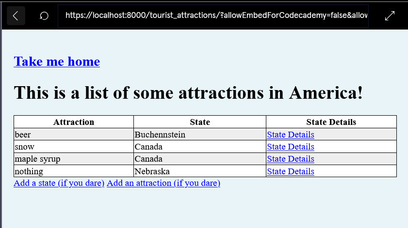

# HR Manager (Django) — Codecademy Project (Code Snapshot)

This repo contains the core Django **app code** (models, forms, urls) from my Codecademy project.  
The full project scaffolding (settings, base templates, static) isn’t included here yet.

## What’s inside
- models, forms, urls .py files.
- Templates

## Next steps (planned)
- Add minimal Django project wrapper + templates so it runs locally.
- Publish HTML notebook/overview + screenshots.
# HR Manager (Django) — Code Snapshot
Core app code (models, forms, urls, templates) from my Codecademy project. Full project wrapper (settings/templates/static) to be added later.

